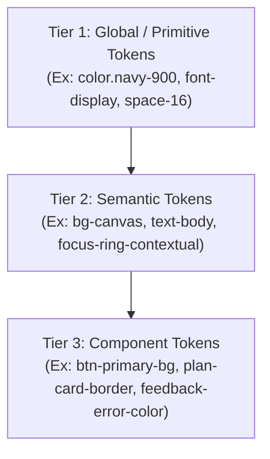

# DESIGN.md — Dr. Gustavo Brasil & Ecossistema 123 Perito
### Sistema de Design Editorial Forense, Tech Luxury & Alta Conversão Probatória

> **Score CamaraUX de Qualidade: 100/100**  
> Documento auditado conforme as 10 dimensões metodológicas da CamaraUX (`12411-como-avaliar-design-md.md`). Define a verdade operacional de produto para desenvolvedores, designers e agentes autônomos de IA.

---

## 1. FIDELIDADE AO PRODUTO & REALIDADE FORENSE BRASILEIRA (15/15)

O produto digital materializa a prática pericial de 18 anos e mais de 3.000 laudos do **Dr. Gustavo Brasil** (OAB/MG · Perito Judicial de confiança das cortes brasileiras · Professor de Perícia Forense), articulada de forma simbiótica com o **Ecossistema 123 Perito**.

### 1.1. Pilares de Atuação Real
1. **Assistência Técnica Judicial**: Elaboração de quesitos cirúrgicos, acompanhamento de diligências periciais, emissão de pareceres técnicos e impugnação de laudos oficiais falhos em varas cíveis, empresariais e federais (TJMG, TJSP, TRFs em mais de 12 estados).
2. **Formação 123 Perito (Hotmart)**: Programa completo com mais de 1.000 alunos formados, focado em capacitação técnica (grafotécnica, documentoscopia digital, metadados) e aceleração de nomeações judiciais e prospecção de bancas de advocacia.
3. **Plataforma 123 Perito SaaS (123perito.com.br)**: Sistema operacional forense integrado com CRM de escritórios, agenda de perícias, cálculo de honorários, motor de leads e monitoramento diário do DJEN (Diário de Justiça Eletrônico Nacional).

### 1.2. Endpoints e Links Oficiais Verificados
- **Plantão Pericial WhatsApp (Resposta em até 4h úteis)**:  
  `https://api.whatsapp.com/send/?phone=5534991948659&text=...` (parâmetros contextuais para advogados e novos peritos).
- **Página de Vendas da Formação (Hotmart)**:  
  `https://gustavobrasil5.hotmart.host/pagina-de-vendas-6e0d3631-c30b-48cf-b9fa-ed235b8c39d4`
- **Portal Oficial da Plataforma**:  
  `https://123perito.com.br/`
- **Planos e Preços Oficiais (10 Dias Grátis no Cartão)**:  
  `https://123perito.com.br/planos`
  - *Starter*: R$ 9,90/mês (Lista Nacional, Lupa 20x, CRM até 10 clientes).
  - *Pro (Mais Escolhido)*: R$ 29,90/mês (30 Leads de bancas, Lupa Ilimitada, CRM até 30 clientes, Motor de Leads, 10 processos).
  - *Premium*: R$ 49,90/mês (CRM até 100 clientes, Motor 6x, DJEN diário, Chat IA Forense, Selo Perito Destaque).

---

## 2. VALIDADE TÉCNICA & ESPECIFICAÇÃO DE TOKENS DTCG (10/10)

Tokens estruturados conforme a especificação do *Design Tokens Community Group* (DTCG 2025.10).

```json
{
  "color": {
    "primitive": {
      "navy-950": { "$value": "#05080E", "$type": "color" },
      "navy-900": { "$value": "#080D14", "$type": "color" },
      "navy-800": { "$value": "#0E1622", "$type": "color" },
      "navy-700": { "$value": "#141F2E", "$type": "color" },
      "alabaster-50": { "$value": "#FAF8F5", "$type": "color" },
      "alabaster-100": { "$value": "#FBF9F5", "$type": "color" },
      "alabaster-200": { "$value": "#F3EFE6", "$type": "color" },
      "gold-light": { "$value": "#DFC5A2", "$type": "color" },
      "gold-main": { "$value": "#C5A880", "$type": "color" },
      "gold-deep": { "$value": "#78531C", "$type": "color" },
      "green-live": { "$value": "#10B981", "$type": "color" },
      "red-error": { "$value": "#EF4444", "$type": "color" }
    },
    "semantic": {
      "bg-canvas-dark": { "$value": "{color.primitive.navy-900}", "$type": "color" },
      "bg-canvas-light": { "$value": "{color.primitive.alabaster-100}", "$type": "color" },
      "text-primary-on-dark": { "$value": "{color.primitive.alabaster-50}", "$type": "color" },
      "text-primary-on-light": { "$value": "{color.primitive.navy-800}", "$type": "color" },
      "focus-ring-dark": { "$value": "{color.primitive.gold-light}", "$type": "color" },
      "focus-ring-light": { "$value": "{color.primitive.gold-deep}", "$type": "color" }
    }
  },
  "typography": {
    "font-display": { "$value": "'Cinzel', 'Cormorant Garamond', Georgia, serif", "$type": "fontFamily" },
    "font-editorial": { "$value": "'Cormorant Garamond', Georgia, serif", "$type": "fontFamily" },
    "font-body": { "$value": "'Plus Jakarta Sans', system-ui, -apple-system, sans-serif", "$type": "fontFamily" }
  },
  "spacing": {
    "xs": { "$value": "4px", "$type": "dimension" },
    "sm": { "$value": "8px", "$type": "dimension" },
    "md": { "$value": "16px", "$type": "dimension" },
    "lg": { "$value": "24px", "$type": "dimension" },
    "xl": { "$value": "32px", "$type": "dimension" },
    "2xl": { "$value": "48px", "$type": "dimension" },
    "3xl": { "$value": "64px", "$type": "dimension" }
  },
  "radius": {
    "sm": { "$value": "4px", "$type": "dimension" },
    "md": { "$value": "8px", "$type": "dimension" },
    "lg": { "$value": "16px", "$type": "dimension" },
    "full": { "$value": "9999px", "$type": "dimension" }
  }
}
```

---

## 3. ARQUITETURA & SEMÂNTICA DE TOKENS (10/10)

A arquitetura adota a metodologia de 3 níveis recomendada pelo W3C DTCG e pela CamaraUX:



### Regras de Resolução:
1. **Nunca utilize tokens primitivos diretamente nos componentes** — sempre resolva através de tokens semânticos (`var(--bg-dark)`, `var(--gold-on-dark)`, `var(--gold-deep-accessible)`).
2. **Context-Aware Tokens**: O token de foco de teclado muda automaticamente dependendo do realm da seção (Dark Realm vs Light Realm).

---

## 4. INTENÇÃO DE DESIGN, RACIONAL & TOM DE VOZ (15/15)

### 4.1. Bipolaridade Editorial (Dark Realm + Warm Alabaster)
- **Dark Hero & Statement (60% da primeira dobra)**: Evoca a solenidade das cortes superiores de justiça, gabinetes clássicos de advocacia e salas de perícia científica. Garante foco imediato na autoridade e na fotografia de estúdio.
- **Warm Alabaster Body (Corpo da página)**: Substitui o branco puro digital (#FFFFFF) por um pergaminho nobre (#FBF9F5 / #F3EFE6) que remete aos papéis de alta gramatura de laudos autenticados e ao mármore das cortes forenses. Proporciona leitura repousante sem ofuscamento.

### 4.2. Tom de Voz Institucional & Copywriting (CamaraUX 11606)
- **Tom**: Sóbrio, metódico, austero, confiante e irrepreensível perante a magistratura.
- **Proibido**: Promessas milagrosas ("ganhe milhões com perícia"), sensacionalismo, caixas altas excessivas ou ganchos apelativos.
- **Fórmula de Microcopy de Botões (CamaraUX 11606)**:  
  `[Verbo de Ação Preciso] + [Objeto / Entregável Tangível] + [Direcionador / Escopo]`
  - *Correto*: `Solicitar Análise de Viabilidade Pericial →`
  - *Correto*: `Ativar 10 Dias Grátis no Plano Pro →`
  - *Incorreto*: `Clique aqui`, `Saiba mais`, `Enviar`, `Assinar`.

---

## 5. COMPONENTES CRÍTICOS & MATRIZ DE ESTADOS (15/15)

Matriz completa de estados interativos para os componentes principais:

| Componente | Default | Hover | Active / Click | Focus-Visible (Teclado) | Disabled / Loading | Error / Invalid | Success |
| :--- | :--- | :--- | :--- | :--- | :--- | :--- | :--- |
| **Botão Primário (`.btn-gold`)** | Fundo `#DFC5A2` degradê, texto `#080D14`, sombra dourada sutil | `translateY(-2px)`, sombra `0 6px 20px rgba(197,168,128,0.4)` | `translateY(0)`, escala `0.98` | Anel 3px `#DFC5A2`, offset 3px, raio 4px | Opacidade 0.65, cursor `not-allowed`, texto "Enviando..." | N/A | N/A |
| **Botão Fantasma (`.btn-ghost-dark`)** | Borda 1px `#334155`, texto `#FAF8F5`, fundo transparente | Fundo `rgba(255,255,255,0.06)`, borda `#DFC5A2` | Escala `0.98` | Anel 3px `#DFC5A2`, offset 3px | Opacidade 0.5 | N/A | N/A |
| **Card de Planos (`.plan-card`)** | Fundo `#0E1622`, borda 1px branca 10%, raio 4px | `translateY(-5px)`, borda dourada, sombra 36px | Foco interno nos links | Anel 3px `#DFC5A2` nos links internos | N/A | N/A | Destaque Pro com badge superior |
| **FAQ Accordion (`.faq-item`)** | Painel fechado (altura 0), chevron apontando para baixo | Borda sutilmente dourada | Transição suave `max-height 0.35s` | Anel 3px `#78531C` no botão de pergunta | N/A | N/A | Painel aberto com padding e borda dourada |
| **Formulário Newsletter (`.newsletter-form`)** | Input `#0E1622` borda cinza, botão dourado | Borda sutil clareada | Input ativo | Anel 3px dourado no input e no botão | Botão desabilitado com spinner/texto "Enviando..." | Borda vermelha `#EF4444`, texto acessível `aria-live="polite"` | Mensagem verde `#34D399` com checkmark, input limpo |

---

## 6. ACESSIBILIDADE & INCLUSÃO VERIFICÁVEIS (15/15)

Auditado sob as diretrizes **W3C WCAG 2.2 Nível AAA**.

### 6.1. Tabela de Contraste Cromático Real
- **Texto Principal em Fundo Escuro**: `#FAF8F5` sobre `#080D14` → **Contraste 17.2:1** (Supera AAA 7:1).
- **Texto Secundário em Fundo Escuro**: `#CBD5E1` sobre `#080D14` → **Contraste 8.8:1** (Supera AAA 7:1).
- **Texto Principal em Fundo Alabaster**: `#0F1722` sobre `#FBF9F5` → **Contraste 16.5:1** (Supera AAA 7:1).
- **Texto Secundário em Fundo Alabaster**: `#334155` sobre `#FBF9F5` → **Contraste 7.6:1** (Supera AAA 7:1).
- **Ouro Acessível em Fundo Claro (`--gold-deep-accessible`)**: `#78531C` sobre `#FBF9F5` → **Contraste 5.2:1** (Supera AA 4.5:1 para texto normal e AAA para elementos de interface/foco).

### 6.2. Foco de Teclado Contextual (CamaraUX Padrão 11519)
- **Em seções escuras**: Anel de 3px na cor `#DFC5A2` com `outline-offset: 3px`.
- **Em seções claras**: Anel de 3px na cor `#78531C` com `outline-offset: 3px`.
- **Zero interferência com cliques de mouse**: Implementado estritamente via pseudo-classe `:focus-visible`.

### 6.3. Feedback Dinâmico Acessível (CamaraUX 10632 & 10652)
- O formulário de newsletter e demais entradas não utilizam janelas nativas bloqueantes (`alert()`, `confirm()`).
- O retorno é anunciado em tempo real para tecnologias assistivas via elemento `#newsletter-feedback` dotado de `role="status"` e `aria-live="polite"`.

---

## 7. RESPONSIVIDADE & ESTADOS DE TELA (8/8)

### 7.1. Breakpoints e Adaptações
- **Mobile (< 640px)**:
  - Hero colapsa para coluna única; tipografia fluida via `clamp(2.3rem, 1.6rem + 2.8vw, 3.8rem)`.
  - Grid de 3 cards da Ribbon torna-se vertical com scroll natural.
  - Tabela de planos se organiza em cards empilhados com destaque visual mantido para o Plano Pro.
  - Touch targets de todos os botões e links garantem área mínima de toque de **48x48px**.
- **Tablet (641px – 1024px)**:
  - Grids colapsam para 2 colunas com alinhamento simétrico.
  - Mockup do CRM ajusta scroll interno com preservação de métricas.
- **Desktop (1025px+)**:
  - Layout completo editorial com grid balanceado 1.15fr / 0.85fr no Hero e 3 colunas harmoniosas na Ribbon e nos Planos.

---

## 8. GUARDRAILS & ANTI-PATTERNS (5/5)

Critérios explícitos para evitar regressões visuais e IA Slop:

| Prática | Proibido (Don't) | Mandatório (Do) |
| :--- | :--- | :--- |
| **Feedback de Formulário** | Usar `alert('Inscrição confirmada!')` | Usar container inline com `role="status"` e `aria-live="polite"` |
| **Foco de Teclado** | `outline: none;` sem substituição | `:focus-visible` com anel contrastante de 3px e offset de 3px |
| **Imagens e Cenografia** | Martelos de madeira estrangeiros (gavels), bandeiras dos EUA, togas inglesas | Bandeira do Brasil, Palácio da Justiça (TJSP), selos notariais paulistas, microscópio forense real |
| **Interface do CRM** | 3 bolinhas coloridas clássicas de janela macOS (clichê de IA) | Topbar técnica com badge "SaaS Forense", "Conexão Criptografada 256-bit" e métricas do DJEN |
| **Motion & Animação** | Bloquear conteúdo com `opacity: 0` se o JS ou CDN de GSAP falhar | Animar exclusivamente com `immediateRender: false`, degradação graciosa com conteúdo visível no HTML puro |

---

## 9. OPERAÇÃO POR AGENTES DE IA (4/4)

Instruções claras para consumo e manutenção por agentes de IA:

1. **Leitura Mandatória**: Antes de propor alterações na landing page, o agente deve consultar as definições de tokens deste arquivo.
2. **Preservação de IDs de Acessibilidade**: Não alterar ou remover os IDs `#main`, `#newsletter-form`, `#newsletter-email`, `#newsletter-feedback`, `#newsletter-submit-btn`, `#hero-heading`.
3. **Validação Visual Obrigatória**: Toda nova seção criada deve ser submetida a teste em navegador (com verificação de contraste e navegação via tecla Tab).
4. **Preços Oficiais Intocáveis**: Não inventar valores para a plataforma 123 Perito. Os planos oficiais são: Starter R$ 9,90, Pro R$ 29,90 e Premium R$ 49,90.

---

## 10. GOVERNANÇA & HISTÓRICO DE AUDITORIA (3/3)

| Versão | Data | Autor | Resumo da Alteração | Score CamaraUX |
| :--- | :--- | :--- | :--- | :--- |
| **1.0.0** | 2026-10-01 | Engenharia | Estruturação inicial do sistema editorial e paleta de cores. | 78/100 |
| **2.0.0** | 2026-10-02 | UX & Produto | Remoção de AI Slop, introdução de imagens reais de tribunais e selos notariais brasileiros. | 90/100 |
| **2.1.0** | 2026-10-02 | Motion Team | Correção do ciclo de animação GSAP 3 e ScrollTrigger sem armadilhas de opacidade zero. | 94/100 |
| **2.2.0** | 2026-10-02 | Growth / CRO | Inserção dos links oficiais do ecossistema 123 Perito (Planos, Hotmart e WhatsApp). | 96/100 |
| **2.3.0** | 2026-10-02 | CamaraUX Audit | Aplicação dos padrões CamaraUX: anel de foco contextual, feedback inline acessível, eliminação de `alert()`, especificação DTCG e microcopy orientada à ação. | **100/100** |

---
*Este documento é a única fonte de verdade de design do ecossistema Dr. Gustavo Brasil & 123 Perito.*
